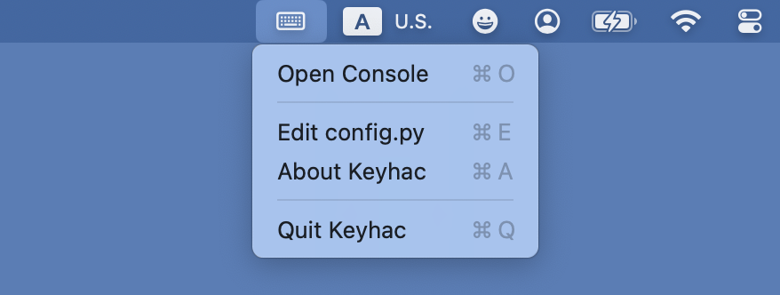
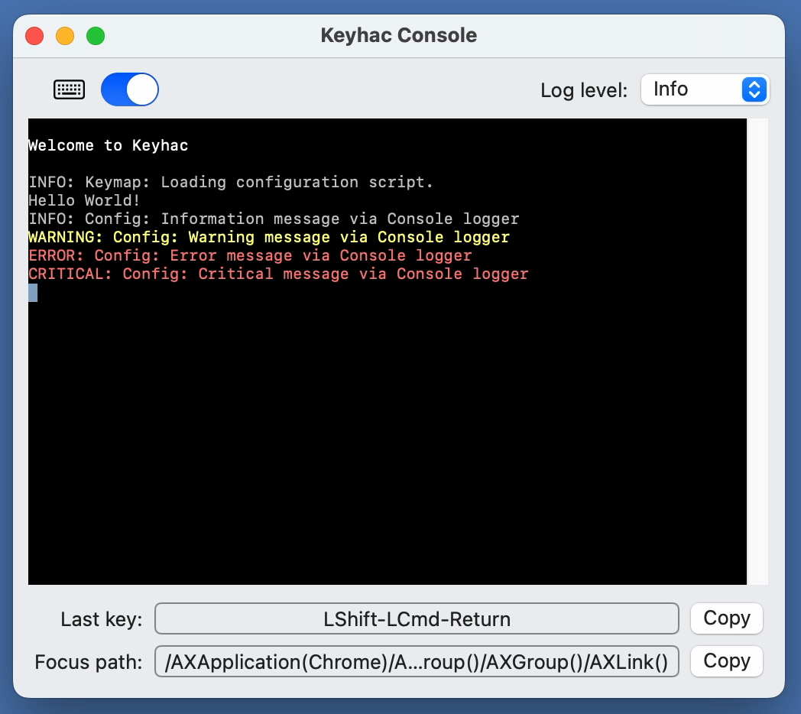
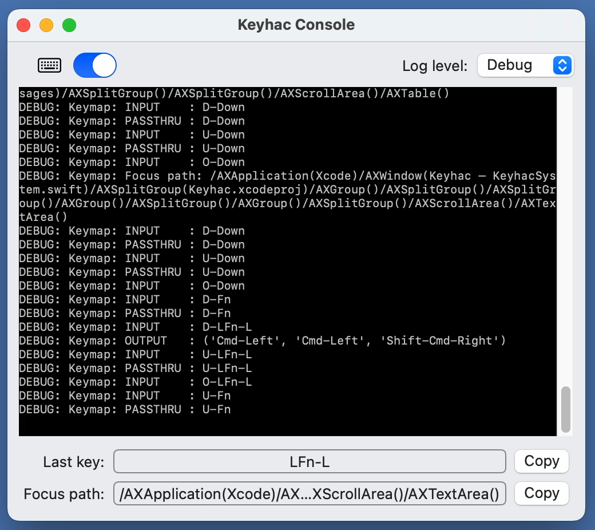

## Keyhac for macOS - Customize keyboard actions with Python

### Overview

Keyhac is a utility application for macOS that allows you to customize keyboard actions for any application using the Python scripting language.
Keyhac gives you the flexibility to customize the behavior of various applications.


### Download & Install

1. Download the installation package (`Keyhac-x.yy.zip`) from the [Releases](https://github.com/crftwr/keyhac-mac/releases) page.
1. Extract the Zip file and copy `Keyapp.app` to `/Applications/`.
1. Launch Keyhac from LaunchPad or Spotlight.
1. When the "Accessibility Access" dialog appears, select "Open System Settings" and enable accessibility control for Keyhac.
1. Open Keyhac's console window from the "Keyboard" icon int the menu bar extra space.
1. Enable keyboard hook with the toggle switch in the top-left of the console window.


### How to configure

1. Open and edit `~/keyhac/config.py` in your preferred text editor. You can use "Edit config.py" from the menu bar.
1. Open Keyhac's console window from the "Keyboard" icon int the menu bar extra space.
1. Operate the toggle switch off → on to reload the configuration file.
1. Verify the configured behavior.


### Documents

- [Keyhac User Guide Document](docs/index.md)
- [Keyhac API reference](docs/api_reference.md)

### Features

- Replace a key with another key
- Differentiate key bindings for focused applications and focused UI elements
- Handle multi-stroke keys (e.g., Ctrl-X + Ctrl-O )
- Move active window by keyboard
- Activate an application by keyboard
- Launch an application by keyboard
- Define custom actions in Python
- Define custom modifier keys in addition to the standard ones
- Execute actions with a "one-shot" modifier keystroke.
- (Coming soon) Record and play back keystrokes


### Screenshots

**Menu bar icon and menu**
<br/>

**Console window**
<br/>

**Debug logging level**
<br/>


### Sample configuration

``` python
from keyhac import *

def configure(keymap):

    # Replacing Right-Shift key with BackSpace
    keymap.replace_key( "RShift", "Back" )

    # Defining user defined modifier keys
    keymap.define_modifier( "RCmd", "RUser0" )
    keymap.define_modifier( "RAlt", "RUser1" )

    # =====================================================
    # Global key table
    # =====================================================

    keytable_global = keymap.define_keytable(focus_path_pattern="*")

    # -----------------------------------------------------
    # User0-D: Lookup selected words in the dictionary app
    def lookup_dictionary():

        elm = keymap.focus

        if "AXSelectedText" in elm.get_attribute_names():
            words = elm.get_attribute_value("AXSelectedText")
            words = urllib.parse.quote(words)
            cmd = ["open", f"dict://{words}"]
            r = subprocess.run(cmd, capture_output=True, text=True)
            if r.stdout: logger.info(r.stdout.strip())
            if r.stderr: logger.error(r.stderr.strip())

    keytable_global["User0-D"] = lookup_dictionary

    # -----------------------------------------------------
    # Fn-M: Zoom window (Test of UIElement.performAction)
    def zoom_window():

        elm = keymap.focus

        while elm:
            role = elm.get_attribute_value("AXRole")
            if role=="AXWindow":
                break
            elm = elm.get_attribute_value("AXParent")

        if elm:
            names = elm.get_attribute_names()
            if "AXZoomButton" in names:
                elm = elm.get_attribute_value("AXZoomButton")
                if elm:
                    actions = elm.get_action_names()
                    elm.perform_action("AXPress")

    keytable_global["Fn-M"] = zoom_window

    # -----------------------------------------------------
    # User0-Left/Right/Up/Down: Move current active window
    keytable_global["User0-Left"]  = MoveWindow(-10,0)
    keytable_global["User0-Right"] = MoveWindow(+10,0)
    keytable_global["User0-Up"]    = MoveWindow(0,-10)
    keytable_global["User0-Down"]  = MoveWindow(0,+10)

    # -----------------------------------------------------
    # User0-T/F/C: Launch an applications
    keytable_global["User0-T"] = LaunchApplication("Terminal.app")
    keytable_global["User0-F"] = LaunchApplication("ForkLift.app")
    keytable_global["User0-C"] = LaunchApplication("Visual Studio Code.app")
    keytable_global["User0-J"] = LaunchApplication("JJJ")


    # =====================================================
    # Key table for Xcode
    # =====================================================

    keytable_xcode = keymap.define_keytable( focus_path_pattern="/AXApplication(Xcode)/*/AXTextArea()" )

    # -----------------------------------------------------
    # Fn-L: Select whole line
    keytable_xcode["Fn-L"] = "Cmd-Left", "Cmd-Left", "Shift-Cmd-Right"

    # -----------------------------------------------------
    # Test of Multi-stroke key binding
    keytable_xcode["Ctrl-X"] = keymap.define_keytable(name="Ctrl-X")
    keytable_xcode["Ctrl-X"]["Ctrl-O"] = "Cmd-O"
