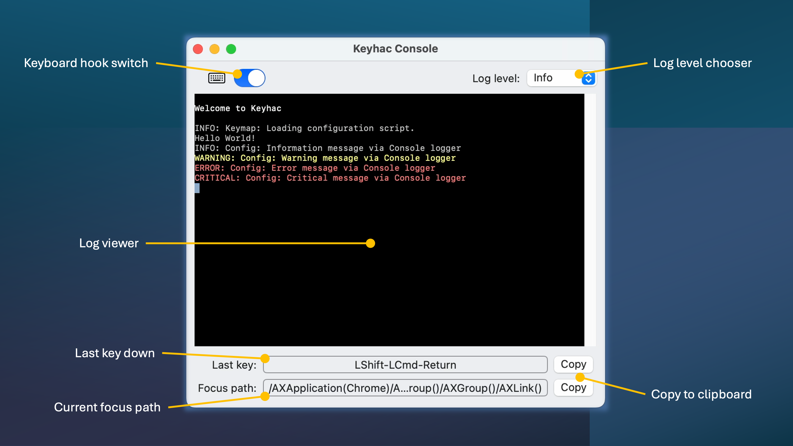

# Keyhac for macOS - User Guide Document

## Console Window features




## Configuration script structure

The configuration file for Keyhac is a Python script (`config.py`) located in `~/.keyhac`.

``` python
from keyhac import *

def configure(keymap):
    keytable_global = keymap.define_keytable(focus_path_pattern="*")
    keytable_global["Fn-J"] = "Left"
    keytable_global["Fn-K"] = "Down"
    keytable_global["Fn-L"] = "Right"
    keytable_global["Fn-I"] = "Up"

    keytable_xcode = keymap.define_keytable( focus_path_pattern="/AXApplication(Xcode)/*/AXTextArea()" )
    keytable_xcode["Fn-A"] = "Cmd-Left", "Cmd-Left", "Shift-Cmd-Right"
```

The configuration script `config.py` has a function `configure()`. It is called by Keyhac when enabling keyboard hook. You can define key-tables in this function.

The function `configure()` receives a `Keymap` object as an argument. `Keymap` object manages key-tables and executes key action translations.


## Global key-table

``` python
keytable_global = keymap.define_keytable(focus_path_pattern="*")
```

A Global key-table is a KeyTable class instance that always applies regardless of the current focused application. You can create a global key-table using `keymap.define_keytable(focus_path_pattern="*")`. `*` is passed to the argument `focus_path_pattern=` to make this key-table match all focus conditions.

A KeyTable object can be used like a dictionary, allowing you to associate input key conditions with output key actions such as 1) output key(s), and 2) Python callable objects like functions and class instances. 

``` python
keytable_global["Fn-J"] = "Left"
keytable_global["Fn-N"] = "1", "2", "3"
keytable_global["Fn-M"] = hello_world
```


## Define application/focus specific key-tables

``` python
keytable_xcode = keymap.define_keytable( focus_path_pattern="/AXApplication(Xcode)/*/AXTextArea()" )
```

You can also create application/focus specific key-tables using `keymap.define_keytable()`. The argument `focus_path_pattern=` specifies the focus path pattern.

A focus path is a Keyhac specific concept that represents the application > window > UI element that is currently focused.

```
/AXApplication(Mail)/AXWindow(Inbox – 118,569 messages, 4 unread)/AXSplitGroup()/AXSplitGroup()/AXScrollArea()/AXGroup()/AXScrollArea()/AXGroup()/AXGroup()/AXScrollArea()/AXWebArea()
```

When specifying `focus_path_pattern=` you can use wildcard patterns using `*`, `?`, `[]`. For the information about wildcards, see the [Python fnmatch document](https://docs.python.org/3/library/fnmatch.html).

If you need your own logic for checking the focus condition, you can pass a function to `custom_condition_func=` as below:

``` python
def is_terminal_window(elm):
    try:
        window_elm = elm.getAttributeValue("AXWindow")
        if window_elm:
            app_elm = window_elm.getAttributeValue("AXParent")
            if app_elm:
                app_title = app_elm.getAttributeValue("AXTitle")
                return app_title in ("Terminal", "iTerm2")
        return False
    except KeyError:
        return False

keytable_terminal = keymap.define_keytable( custom_condition_func = is_terminal_window )
```

## Key -> Key

The most basic use of a key-tables is to associate input key condition with output key(s).

``` python
keytable_global["Fn-J"] = "Left"
```

Both input key conditions and output keys are expressed as strings formmated as follows.

```
{Modifier1}-{Modifier2}-...{PrimaryKey}
```

Here are some examples:

``` python
"Cmd-X"       # Command + X
"Shift-Alt-Z" # Shift + Option + Z
"Fn-A"        # Fn + A
```

You can assign multiple keystrokes using a tuple of strings.

``` python
keytable_global["Fn-N"] = "Cmd-1", "Cmd-2", "Cmd-3"
```

## Key -> functions/classes

Keyhac allows you to execute any custom actions by associating a Python callable objects with input key conditions. Below is an example of executing a Python function as an output key action.

``` python
def hello_world():
    print("Hello World!")

keytable_global["Fn-A"] = hello_world
```

You can also use class instances by defining a `__call__` method in the class to make it callable.

``` python
class MoveWindow:
    def __init__(self, x, y):
        self.x = x
        self.y = y

    def __call__(self):

        elm = keymap.focus

        while elm:
            role = elm.getAttributeValue("AXRole")
            if role=="AXWindow":
                break
            elm = elm.getAttributeValue("AXParent")

        if elm:
            names = elm.getAttributeNames()
            pos = elm.getAttributeValue("AXPosition")
            pos[0] += self.x
            pos[1] += self.y
            elm.setAttributeValue("AXPosition", "point", pos)

keytable_global["User0-Left"]  = MoveWindow(-10,0)
keytable_global["User0-Right"] = MoveWindow(+10,0)
keytable_global["User0-Up"]    = MoveWindow(0,-10)
keytable_global["User0-Down"]  = MoveWindow(0,+10)
```

## Multi-stroke key-table

As an advanced feature, Keyhac supports multi-stroke key input by creating a KeyTable with `keymap.define_keytable()` and associating it as an action in another key-table.

``` python
keytable_xcode["Ctrl-X"] = keymap.define_keytable(name="Ctrl-X")
```

In the above example, `Ctrl-X` in `keytable_xcode` is chained to the multi-stroke key-table. To associate a second keystroke condition, you can use the following syntax.

``` python
keytable_xcode["Ctrl-X"]["Ctrl-O"] = "Cmd-O"
```


## Replace keys

Keymap has a key replacement table. You can add source and destination key paires using `keymap.replace_key()`.

``` python
keymap.replace_key( "RShift", "Back" )
```

The substitution is done before processing the key-tables, so the input key condition for the key-tables must use the substituted key.

In the above example, the meaning of the Right Shift key is replaced with Back Space key. When the key-tables are processed, the Right Shift key is no longer recognized as a Shift key.


## Define modifier keys

In addition to the standard modifier keys (Shift, Control, Option, Command, Fn), Keyhac allows you to define additional user modifier keys (User0, User1, for both left and right).

``` python
keymap.define_modifier( "RCmd", "RUser0" )
keymap.define_modifier( "RAlt", "RUser1" )
```

Defining user modifier keys allows you to use `User0`, `User1` (and left/right specific variations `LUser0`, `LUser1`, `RUser0`, `RUser1`) in key expressions in the key-tables.


## One-shot modifiers

A "One-shot modifier" is a special key condition that is triggered when the modifier key is pressed and released with no other keys pressed in between.

This is particularly useful if you have defined user modifier keys, but want the key to be used for something else when pressed and released alone.

You can assign one-shot modifiers to key-tables using the `O-` prefix.

``` python
keytable_global["O-RAlt"] = "Space"
```

## Built-in action classes

Keyhac provides some built-in action classes for your convenience.

#### ThreadedAction

Keyhac uses keyboard hooks to intercept all keystrokes across the system. Keyhac's keyboard hook handlers and user-defined actions are expected to complete their processings quickly to maintain system performance.

`ThreadedAction` can be used as a base class of time-consuming actions. When ThreadedAction (and its child classes) are used as a key action, it uses a thread pool internally to execute the main part of the action, allowing the keyboard hook to return immediately.

``` python
class SomeHeavyAction(ThreadedAction):
    def starting(self):
        # light-weight task when action is triggered

    def run(self):
        # time consuming task executed in thread-pool

    def finished(self, result):
        # light-weight task when the action is completed

keytable_global["User0-Z"] = SomeHeavyAction()
```


## UIElement class

`UIElement` class represents a user interface related object on the system, such as an application, a window, a button, a menu bar, or a text edit field. Keyhac uses the `UIElement` class for two purposes, 1) identify focused application and UI element, 2) operate graphical user interface programmatically by key actions.

`keymap.focus` is a read-only property of Keymap class, and it is a `UIElement` object that represents the current keyboard focus.

Following is an example how to find the Zoom button of the focused window, and click it.

``` python
def zoom_window():

    elm = keymap.focus

    while elm:
        role = elm.getAttributeValue("AXRole")
        if role=="AXWindow":
            break
        elm = elm.getAttributeValue("AXParent")

    if elm:
        names = elm.getAttributeNames()
        if "AXZoomButton" in names:
            elm = elm.getAttributeValue("AXZoomButton")
            if elm:
                actions = elm.getActionNames()
                elm.performAction("AXPress")

keytable_global["Fn-M"] = zoom_window
```

For more details about UIElement, see the [Keyhac API reference](./api_reference.md).


## Key expression reference

| Expression    | Key           |
| ------------- | ------------- |
| A - Z         |               |
| 0 - 9         |               |
| Minus         | -             |
| Plus          | +             |
| Comma         | ,             |
| Period        | .             |
| Semicolon     | ;             |
| Colon         | :             |
| Slash         | /             |
| BackQuote     | `             |
| Tilde         | ~             |
| OpenBracket   | [             |
| BackSlash     | \             |
| Yen           | ￥            |
| CloseBracket  | ]             |
| Quote         | '             |
| DoubleQuote   | "             |
| Underscore    | _             |
| Asterisk      | *             |
| Atmark        | @             |
| Caret         | ^             |
| NumLock       |               |
| Divide        | / (ten key)   |
| Multiply      | * (ten key)   |
| Subtract      | - (ten key)   |
| Add           | + (ten key)   |
| Decimal       | . (ten key)   |
| Num0 - Num9   | 0-9 (ten key) |
| F1 - F12      |               |
| Left, Right, Up, Down |       |
| Space         |               |
| Tab           |               |
| Back          | Delete        |
| Enter/Return  |               |
| Escape/Esc    |               |
| CapsLock/Caps/Capital |       |
| Delete        |               |
| Home          |               |
| End           |               |
| PageUp        |               |
| PageDown      |               |
| LAlt          | Left Option   |
| RAlt          | Right Option  |
| LCtrl         | Left Control  |
| RCtrl         | Right Control |
| LShift        | Left Shift    |
| RShift        | Right Shift   |
| LCmd          | Left Command  |
| RCmd          | Right Command |
| Fn            |               |
| (0) - (255)   | Virtual key code |
